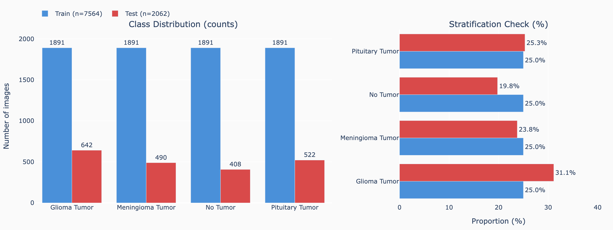
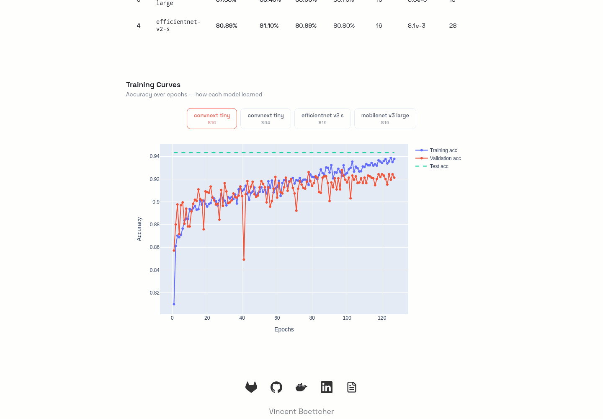

# ECHO

[](https://gitlab.com/vin-br/echo) [](https://github.com/vin-br/echo) [](https://hub.docker.com/u/vinbr) [](https://gitlab.com/vin-br/echo/-/pipelines?ref=main) [](https://www.linkedin.com/in/vin-br/)

Echo is a computer vision application I built to automatically detect and annotate brain tumors on MRI scans.


**Built with** PyTorch · FastAPI · SvelteKit · Bun · Docker · Kubernetes · Nginx · Ansible · GitLab CI/CD

---

## Table of contents

- [Use cases](#use-cases)
- [Architecture](#architecture)
- [Dataset distribution](#dataset-distribution)
- [Model metrics](#model-metrics)
- [CI/CD pipeline](#cicd-pipeline)
- [Unit testing](#unit-testing)
- [Technical stack](#technical-stack)
- [Project structure](#project-structure)
- [Installation for users](#installation-for-users)
- [Installation for developers](#installation-for-developers)
- [Contribute](#contribute)
- [Resources](#resources)
- [License and copyright](#license-and-copyright)
- [Disclaimer](#disclaimer)

---

## Use cases

<details>
<summary>No tumor detection</summary>


</details>

<details>
<summary>Glioma tumor detection</summary>


</details>

<details>
<summary>Meningioma tumor detection</summary>


</details>

<details>
<summary>Pituitary tumor detection</summary>


</details>

---

## Architecture

<details>
<summary>Mermaid diagram</summary>


</details>

---

## Dataset distribution

The classification dataset contains 10,315 brain MRI images split 80/20 across 4 classes.



---

## Model metrics

Table overview of model performance metrics available in the app:


These metrics are stored in a DuckDB database located in the folder `backend/data/metrics.duckdb`.

### Training curves

The app includes interactive carousels for training curves (accuracy over epochs) for each model:



---

## CI/CD pipeline

The project uses **GitLab CI/CD** with 3 stages:
1. **Lint** → Runs `ruff` on Python code
2. **Test** → Runs `pytest` on backend
3. **Build** → Builds and pushes Docker images to Docker Hub and GitLab Container Registry

| Trigger | Lint | Test | Build (test) | Build (push) |
|---------|:----:|:----:|:------------:|:------------:|
| MR (any) | ✓ | ✓ | ✓ | manual (`:dev`) |
| Merge → develop | ✓ | ✓ | — | auto (`:dev`) |
| Merge → main | ✓ | ✓ | — | auto (CalVer + `:latest`) |
| Direct push to develop | ✓ | ✓ | — | — |

---

## Unit testing

<details>
<summary>Testing commands</summary>

```shell
# Run Tests from root with verbose output
uv run pytest backend/tests/ -v --tb=auto

# Run Test Coverage for the backend with a report in the terminal
uv run pytest backend/tests/ --cov=backend/app --cov-report=term-missing

# Run Test Coverage with an HTML report
uv run pytest backend/tests/ --cov=backend/app --cov-report=html
```

</details>


---

## Technical stack

<details>
<summary>View full stack details</summary>

- **AI Model:** Convolutional Neural Network (ConvNeXt) using PyTorch
- **Backend:** FastAPI
- **Frontend:** SvelteKit with Bun
- **Reverse Proxy:** Nginx
- **Containerization:** Docker, Docker Compose
- **Orchestration:** Kubernetes (Minikube for local development)
- **Infrastructure as Code (IaC):** Ansible + Docker connection plugin
- **CI/CD:** GitLab CI/CD (Docker Hub + GitLab Container Registry)
- **Versioning:** CalVer (YY.MM)

</details>

---

## Project structure

<details>
<summary>View project tree</summary>

```
├── automate/               # Screenshot & GIF automation (Playwright)
├── vision/                 # Vision model training (PyTorch)
│   ├── classification/     #   Transfer-learning (ConvNeXt, EfficientNetV2, MobileNet, Swin-V2, MaxViT)
│   ├── detection/          #   YOLOv8 fine-tuning
│   ├── common/             #   Shared config, paths, visualization
│   ├── results/            #   Metrics JSON, plots, MLflow runs
│   └── logs/               #   Per-run training logs
├── backend/                # FastAPI backend API
├── data/                   # Dataset files
│   ├── classification/     #   4-class MRI images (tracked in git)
│   └── detection/          #   YOLOv8 bounding-box dataset (download required)
├── frontend/               # SvelteKit frontend (Bun)
├── models/                 # Pre-trained model weights (Git LFS)
│   ├── classification/     #   PyTorch .pt checkpoints
│   └── detection/          #   YOLO .pt weights
├── iac/                    # Infrastructure as Code (Ansible + Docker)
├── k8s/                    # Kubernetes deployment manifests
├── nginx/                  # Nginx reverse proxy configs (prod + dev)
├── media/                  # Screenshots and visual assets
├── scripts/                # Utility scripts (dataset enhancement, distribution plot)
├── docker-compose.yaml     # Docker Compose configuration
├── docker-compose.dev.yaml # Docker Compose for development
├── docker-dev.sh           # Convenience wrapper for dev compose
├── .gitlab-ci.yml          # GitLab CI/CD pipeline configuration
├── README.md               # Project documentation
└── ...                     # Other configuration and resource files
```    

</details>

---

## Installation for users

The available versions are recommended for users who want to discover the app and test it out.
Under no circumstances should this be used to diagnose real cases including your own.

<details>
<summary>Using public Docker Hub images</summary>

**Using Pre-built Docker Images**
Public images are available on Docker Hub for easy user setup:
- [ECHO Backend on Docker Hub](https://hub.docker.com/r/vinbr/echo-backend)
- [ECHO Frontend on Docker Hub](https://hub.docker.com/r/vinbr/echo-frontend)

Before you start:
- make sure you have [Docker](https://www.docker.com/get-started/) installed on your machine.

```shell
# Clone the repository (SSH or HTTPS):
git clone git@gitlab.com:vin-br/echo.git # SSH
git clone https://gitlab.com/vin-br/echo.git # HTTPS

# From root directory, pull and start the containers:
./docker.sh pull
./docker.sh up -d

# The images will be automatically pulled from Docker Hub on first run
# Access the app via Nginx at:
http://localhost:8080
```

The app should now be running locally on your machine through Docker containers.

> The Docker backend image includes the necessary model weights, so no additional download is required.

</details>

## Installation for developers

<details>
<summary>Install Git LFS for model weights</summary>

Make sure you have [Git LFS](https://git-lfs.github.com/) installed to download model files.

```shell
# After cloning, run:
git lfs install
git lfs pull
```

</details>

<details>
<summary>Option A — Using Docker developer setup</summary>

Before you start: make sure you have [Docker](https://www.docker.com/get-started/) installed on your machine.

```shell
# Clone the repository with SSH:
git clone git@gitlab.com:vin-br/echo.git
cd echo

# Pull the model files using Git LFS because they were too large for regular Git:
git lfs pull # requires Git LFS installed

# From root directory, build and start the development containers:
./docker-dev.sh up --build
# Or without the wrapper:
docker compose -f docker-compose.dev.yaml up --build

# Access the app via Nginx at:
http://localhost:8081
```

```shell
# To stop the containers, run:
./docker-dev.sh down

# To rebuild without cache:
./docker-dev.sh build --no-cache
```

</details>

<details>
<summary>Option B — Using Kubernetes with Minikube</summary>

Before you start:
- Make sure you have [Minikube](https://kubernetes.io/docs/tasks/tools/install-minikube/) installed
- Make sure you have [kubectl](https://kubernetes.io/docs/tasks/tools/) installed

For detailed Kubernetes deployment instructions, see [k8s/README.md](k8s/README.md)

```shell
# # From root directory, start and deploy:
minikube start
kubectl apply -f k8s/namespace.yaml
kubectl apply -f k8s/

# Check deployment status
# Verify that the backend and AI pods are running before continuing
kubectl get all -n echo

# Access the application
# Note: Backend may take a minute to load the ML model on first startup
# Be patient!

# Using minikube service (tested with Docker driver on macOS)
minikube service echo-nginx -n echo
# This will open your browser automatically
```

</details>

<details>
<summary>Option C — Using Ansible + Docker (IaC)</summary>

Before you start, make sure you have the following installed:
- [Docker](https://docs.docker.com/get-docker/)
- [Ansible](https://docs.ansible.com/ansible/latest/installation_guide/intro_installation.html)

For detailed instructions, see [iac/README.md](iac/README.md)

```shell
# From the project root, provision a container and start the backend:
./iac/iac-docker.sh

# Access the application at:
http://localhost:8082

# Remove the container:
./iac/iac-docker.sh destroy
```

</details>

---

## Contribute

Feel free to contribute, fork the repository, or just play with it to learn.

<details>
<summary>Documentation (API Swagger)</summary>

The API documentation is automatically generated using FastAPI and can be accessed via Swagger UI at the following URL when the application is running:

```shell
# Swagger UI
http://localhost:8000/docs
```

</details>

<details>
<summary>Training environments</summary>

Both CLIs run locally on the developer's machine for optimal performance. On macOS with Apple Silicon, PyTorch automatically uses **MPS** (Metal Performance Shaders) for GPU-accelerated training.

```shell
# Local training (recommended)
# Uses MPS on Apple Silicon or CUDA on Linux — fastest option.
cd vision
uv sync
# To start interactive training
uv run python -m vision.classification.cli --interactive
```

```shell
# Docker alternative (optional)
# CPU-only, useful for reproducible environments but significantly slower.
./docker-dev.sh --profile training up -d
docker exec -it echo-vision-dev bash
```

</details>

<details>
<summary>Training classification models</summary>

Train a classification model using transfer learning (ConvNeXt, EfficientNetV2, MobileNet, Swin-V2, MaxViT). 

> Optuna automatically finds optimal hyperparameters (learning rate, batch size) before the full training run.

```shell
# From the vision/ directory:

# Interactive mode — prompts for model, epochs, etc. Optuna finds optimal hyperparameters.
uv run python -m vision.classification.cli --interactive

# Direct mode — Optuna searches for the best lr and batch size, then trains
uv run python -m vision.classification.cli convnext-tiny --epochs 150

# Skip Optuna search — provide both lr and batch-size to train directly
uv run python -m vision.classification.cli convnext-tiny --epochs 150 --batch-size 16 --lr 5e-4

# Or launch training with specific parameters sequentially since it can early stop based on Optuna results:
uv run python -m vision.classification.cli convnext-tiny --epochs 150 --batch-size 16 && \
uv run python -m vision.classification.cli mobilenet-v3-large --epochs 150 --batch-size 16 && \
uv run python -m vision.classification.cli efficientnet-v2-s --epochs 150 --batch-size 16

# List available model architectures
uv run python -m vision.classification.cli --list-models
```

| Flag | Default | Description |
|------|---------|-------------|
| `model` | *(required or interactive)* | Model key from registry (`convnext-tiny`, `convnext-small`, `efficientnet-v2-s`, `mobilenet-v3-large`, `swin-v2-t`, `maxvit-t`) |
| `--epochs` | `50` | Full training epochs |
| `--batch-size` | *Optuna* | Batch size (omit to let Optuna find optimal value) |
| `--lr` | *Optuna* | Learning rate (omit to let Optuna find optimal value) |
| `--image-size` | `224` | Input resolution |
| `--n-trials` | `20` | Number of Optuna search trials |
| `--no-augment` | — | Disable data augmentation |
| `--no-normalize` | — | Disable ImageNet normalization |

**Outputs:**
- Checkpoint → `models/classification/<name>.pt`
- Metrics JSON → `vision/results/<name>.json`
- Training curves plot → `vision/results/plots/<name>.html`
- Training log → `vision/logs/<name>.log`
- MLflow run → `vision/results/mlruns/`

</details>

<details>
<summary>Training object-detection models</summary>

Fine-tune YOLOv8 on the brain tumor detection dataset.

```shell
# From the vision/ directory:

# Default training (yolov8n, 100 epochs, batch 16, 640px)
uv run python -m vision.detection.cli

# Custom parameters
uv run python -m vision.detection.cli --model yolov8s.pt --epochs 50 --batch 32 --device mps
```

| Flag | Default | Description |
|------|---------|-------------|
| `--model` | `yolov8n.pt` | YOLO base model (`yolov8n.pt`, `yolov8s.pt`, etc.) |
| `--epochs` | `100` | Max training epochs |
| `--batch` | `16` | Batch size |
| `--imgsz` | `640` | Input image size |
| `--lr0` | `0.01` | Initial learning rate |
| `--patience` | `15` | Early stopping patience |
| `--device` | auto-detected | Device (`cpu`, `0` for GPU, `mps` for Apple Silicon) |
| `--data` | `data/detection/data.yaml` | Path to dataset YAML |

**Outputs:**
- Best weights → `models/detection/yolo-brain-tumor.pt`
- Training run → `vision/results/detection/<run-name>/`

</details>

<details>
<summary>Model weights — Committing a model</summary>

Place the `.pt` file in `models/classification/` or `models/detection/`. The `.gitattributes` glob `models/**/*.pt` auto-tracks it via LFS.

```shell
cp ~/training-output/my-model.pt models/classification/
git add models/classification/my-model.pt
git commit -m "chore: add my-model checkpoint"
git push
```

</details>

<details>
<summary>Model weights — Removing a tracked model</summary>

All `.pt` checkpoint files under `models/` are tracked by [Git LFS](https://git-lfs.github.com).
Always use `git rm`, not manual deletion, so LFS metadata stays consistent.

```shell
git rm models/classification/old-model.pt
git commit -m "chore: remove old-model checkpoint"
git push
```

</details>

<details>
<summary>Versioning</summary>

Versioning follows CalVer: `YY.MM.PATCH` — where `YY.MM` reflects when the work was done and `PATCH` is incremented for each subsequent release within the same month. For example, `26.05.0` is the first release of May 2026, followed by `26.05.1`, `26.05.2`, etc.

</details>

<details>
<summary>Generating dataset distribution plot</summary>

```shell
uv run --no-project --with plotly --with kaleido python3 scripts/gen_distribution_plot.py
```

Output: `media/data-distribution.png`

</details>

<details>
<summary>Generating screenshots and GIFs</summary>

The `automate/` service uses Playwright with Firefox to capture screenshots and GIFs for this README. Training-curve plots are generated automatically during training, so running the automate captures everything in one go.

**Using Docker (recommended):**

```bash
# First, run the test coverage report
cd backend && uv run pytest tests/ --cov=app --cov-report=html && cd ..

# Make sure the dev stack is running:
./docker-dev.sh up -d

# Generate everything (screenshots + GIFs):
./docker-dev.sh run --rm automate-dev all

# Or generate specific assets:
./docker-dev.sh run --rm automate-dev screenshots                   # Static PNGs only
./docker-dev.sh run --rm automate-dev gifs                          # All GIFs
./docker-dev.sh run --rm automate-dev gifs --only overview          # Overview GIF only
./docker-dev.sh run --rm automate-dev gifs --only use-cases         # Use-case GIFs only
./docker-dev.sh run --rm automate-dev gifs --only carousel          # Training curves GIF
./docker-dev.sh run --rm automate-dev gifs --only leaderboard       # Leaderboard toggle GIF
```

Output goes to the `media/` directory.

</details>

---

## Resources

<details>
<summary>Classification Dataset</summary>

Source: combination of these datasets:
- [dataset 1](https://www.kaggle.com/datasets/sartajbhuvaji/brain-tumor-classification-mri)
- [dataset 2](https://www.kaggle.com/datasets/thomasdubail/brain-tumors-256x256/data)
- [dataset 3](https://www.kaggle.com/datasets/masoudnickparvar/brain-tumor-mri-dataset?rvi=1)

Steps taken to clean the dataset:
1. Duplicates were removed. 
2. Files automatically renamed. 
3. Images were shuffled.
4. Images were split between training and testing (0.80/0.20).

</details>


<details>
<summary>Object Detection Dataset</summary>

Source: [Roboflow – Brain Tumor Detection](https://universe.roboflow.com/academia-keleu/brain-tumor-bb6yj) — download in YOLOv8 format.

</details>


<details>
<summary>Documentation</summary>

- [PyTorch](https://docs.pytorch.org/docs/stable/index.html)
- [FastAPI](https://fastapi.tiangolo.com/)
- [DuckDB](https://duckdb.org/docs/stable/)
- [Git LFS](https://git-lfs.github.com/)
- [GitLab CI/CD Docs](https://docs.gitlab.com/ee/ci/)
- [pytest](https://docs.pytest.org/en/stable/)
- [uv](https://docs.astral.sh/uv/)
- [Ruff](https://docs.astral.sh/ruff/)
- [Ty](https://docs.astral.sh/ty/)
- [Docker](https://docs.docker.com/manuals/)
- [Kubernetes Docs](https://kubernetes.io/docs/home/)
- [Minikube Docs](https://minikube.sigs.k8s.io/docs/)
- [Ansible Docs](https://docs.ansible.com/ansible/latest/)

</details>

---

## License and copyright

ECHO is licensed under the Apache 2.0 License. See LICENSE for more details.
Copyright (c) 2026 Vincent Boettcher. All rights reserved.

---

## Disclaimer

This project is built for training and learning purposes, do not use it for real use cases.
