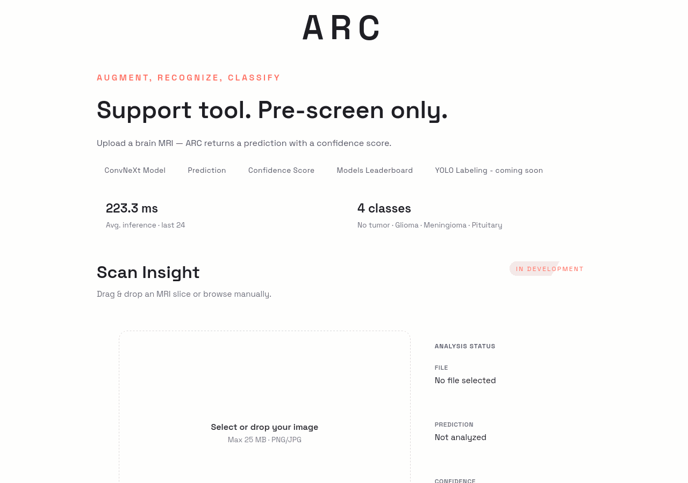
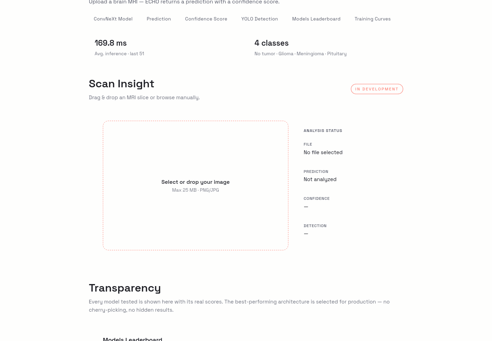
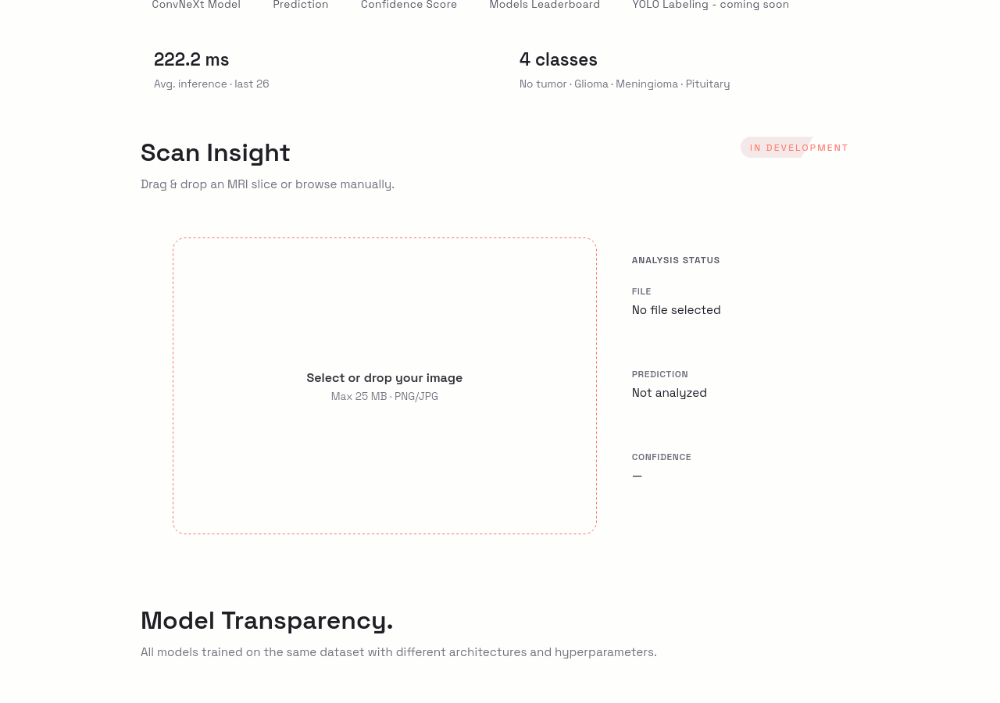
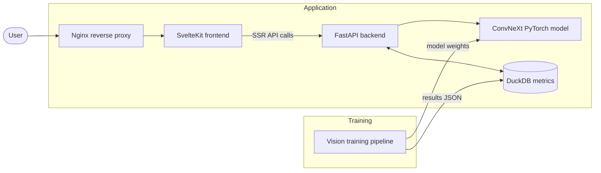
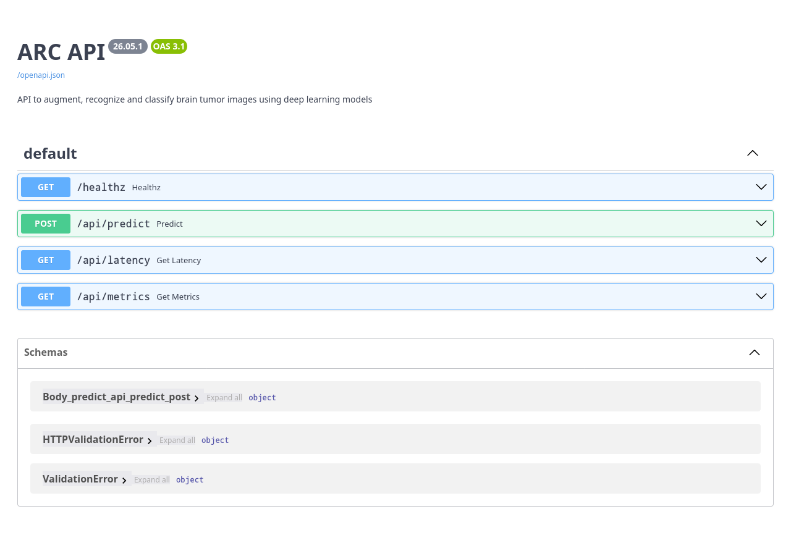
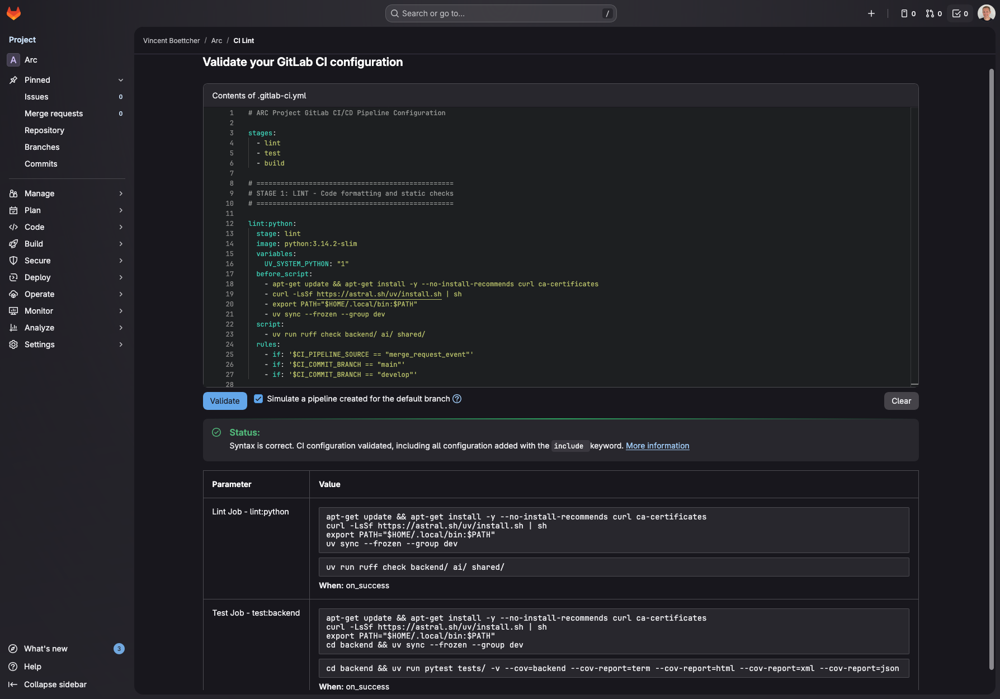
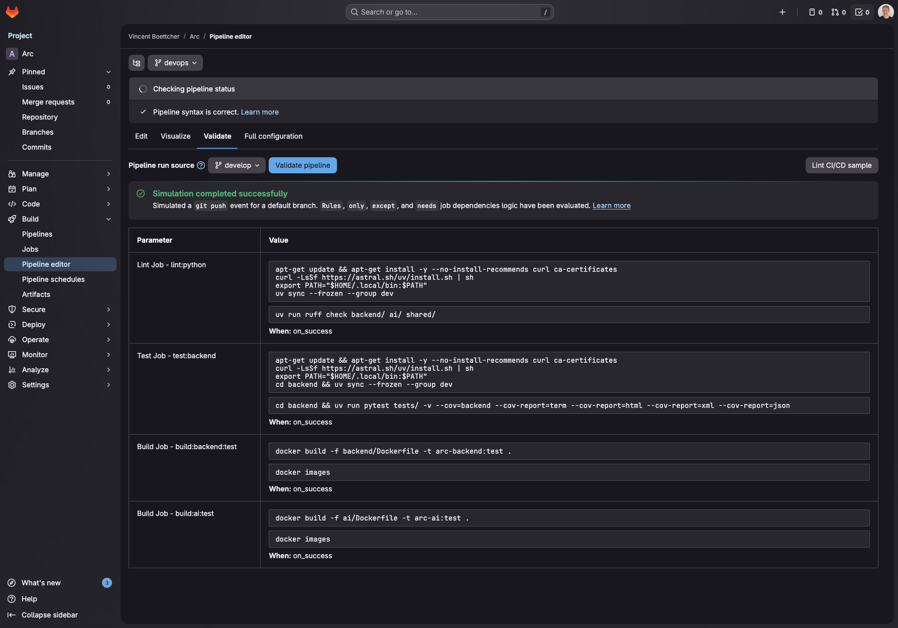
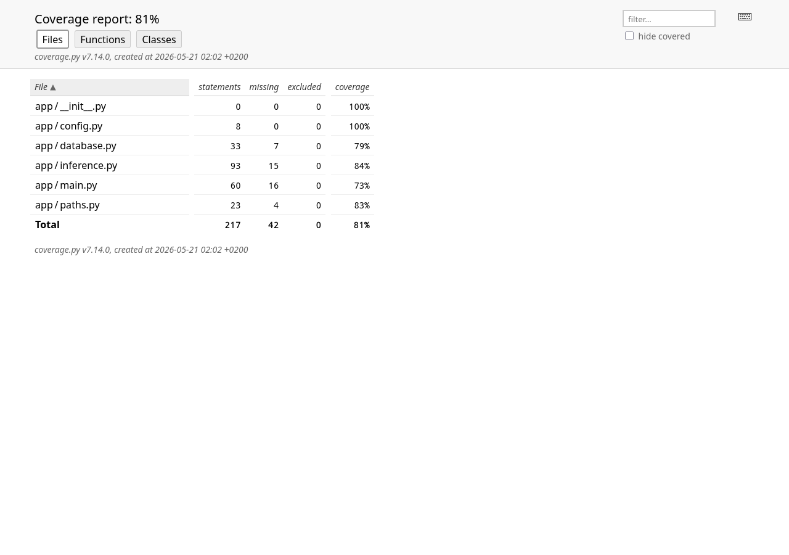
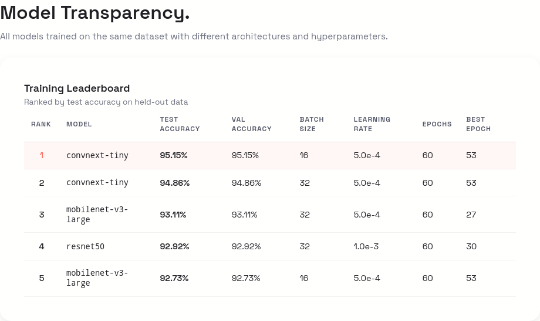

# ARC

[](https://gitlab.com/vin-br/arc) [](https://github.com/vin-br/arc) [](https://hub.docker.com/u/vinbr) [](https://gitlab.com/vin-br/arc/-/pipelines?ref=main) [](https://www.linkedin.com/in/vin-br/)

ARC stands for **Augment**, **Recognize**, **Classify** — and that's the exact pipeline it runs. It's a computer vision application I built to automatically detect and annotate brain tumors on MRI scans.



**Built with** PyTorch · FastAPI · SvelteKit · Bun · Docker · Kubernetes · Nginx · Ansible · GitLab CI/CD

---

## Table of contents

- [Use case](#use-case)
- [Architecture](#architecture)
- [Project structure](#project-structure)
- [Technical stack](#technical-stack)
- [Environment variables](#environment-variables)
- [Installation options](#installation-options)
- [Swagger API documentation](#swagger-api-documentation)
- [CI/CD pipeline](#cicd-pipeline)
- [Unit testing](#unit-testing)
- [Monitoring containers with Netdata container](#monitoring-containers-with-netdata-container)
- [Model metrics](#model-metrics)
- [Versioning](#versioning)
- [Generating screenshots and GIFs](#generating-screenshots-and-gifs)
- [Resources](#resources)
- [Disclamer](#disclamer)

---

## Use case

<details>
<summary>No tumor detection</summary>



</details>

<details>
<summary>Glioma tumor detection</summary>


</details>

<details>
<summary>Meningioma tumor detection</summary>



</details>

<details>
<summary>Pituitary tumor detection</summary>


</details>

---

## Architecture

<details>
<summary>Mermaid diagram</summary>



</details>

---

## Project structure

<details>
<summary>View project tree</summary>

```
├── automate/               # Screenshot & GIF automation (Playwright)
├── vision/                 # Vision model training (PyTorch)
├── backend/                # FastAPI backend API
├── data/                   # Dataset files
├── frontend/               # SvelteKit frontend (Bun)
├── iac/                    # Infrastructure as Code (Ansible + Docker)
├── k8s/                    # Kubernetes deployment manifests
├── models/                 # Pre-trained model weights
├── nginx/                  # Nginx reverse proxy configs (prod + dev)
├── media/                  # Screenshots and visual assets
├── scripts/                # Utility scripts (dataset cleaning)
├── docker-compose.yaml     # Docker Compose configuration
├── docker-compose.dev.yaml # Docker Compose for development
├── docker-dev.sh           # Convenience wrapper for dev compose
├── .gitlab-ci.yml          # GitLab CI/CD pipeline configuration
├── README.md               # Project documentation
└── ...                     # Other configuration and resource files
```    

</details>

---

## Technical stack

<details>
<summary>View full stack details</summary>

- **AI Model:** Convolutional Neural Network (ConvNeXt) using PyTorch
- **Backend:** FastAPI
- **Frontend:** SvelteKit with Bun
- **Reverse Proxy:** Nginx
- **Containerization:** Docker, Docker Compose
- **Orchestration:** Kubernetes (Minikube for local development)
- **Infrastructure as Code (IaC):** Ansible + Docker connection plugin
- **CI/CD:** GitLab CI/CD (Docker Hub + GitLab Container Registry)
- **Versioning:** CalVer (YY.MM)

</details>

---

## Environment variables

<details>
<summary>View environment configuration</summary>

The frontend requires a `BACKEND_URL` environment variable so the SvelteKit server can reach the backend API during SSR.

- **Docker:** Set automatically via `environment:` in docker-compose — no `.env` file needed.
- **Local dev:** Copy `frontend/.env.example` to `frontend/.env` and set `BACKEND_URL=http://localhost:8000`.

</details>

---

## Installation options

<details>
<summary>Option A — Using public Docker Hub images</summary>

**Using Pre-built Docker Images**
Public images are available on Docker Hub for easy user setup:
- [ARC Vision on Docker Hub](https://hub.docker.com/r/vinbr/arc-vision)
- [ARC Backend on Docker Hub](https://hub.docker.com/r/vinbr/arc-backend)
- [ARC Frontend on Docker Hub](https://hub.docker.com/r/vinbr/arc-frontend)

Before you start:
- make sure you have [Docker](https://www.docker.com/get-started/) installed on your machine.

```shell
# Clone the repository (SSH or HTTPS):
git clone git@gitlab.com:vin-br/arc.git # SSH
git clone https://gitlab.com/vin-br/arc.git # HTTPS

# From root directory, pull and start the containers:
./docker.sh pull
./docker.sh up -d

# The images will be automatically pulled from Docker Hub on first run
# Access the app via Nginx at:
http://localhost:8080
```

The app should now be running locally on your machine through Docker containers.

> The Docker backend image includes the necessary model weights, so no additional download is required.

</details>

<details>
<summary>Option B — Using Docker developer setup</summary>

Before you start:
- make sure you have [Docker](https://www.docker.com/get-started/) installed on your machine.
- make sure you have [Git LFS](https://git-lfs.github.com/) installed to download model files.

```shell
# Clone the repository with SSH:
git clone git@gitlab.com:vin-br/arc.git
cd arc

# Pull the model files using Git LFS because they were too large for regular Git:
git lfs pull # requires Git LFS installed

# From root directory, build and start the development containers:
./docker-dev.sh up --build
# Or without the wrapper:
docker compose -f docker-compose.dev.yaml up --build

# Access the app via Nginx at:
http://localhost:8081
```

```shell
# To stop the containers, run:
./docker-dev.sh down

# To rebuild without cache:
./docker-dev.sh build --no-cache
```

</details>

<details>
<summary>Option C — Using Kubernetes with Minikube</summary>

Before you start:
- Make sure you have [Minikube](https://kubernetes.io/docs/tasks/tools/install-minikube/) installed
- Make sure you have [kubectl](https://kubernetes.io/docs/tasks/tools/) installed

For detailed Kubernetes deployment instructions, see [k8s/README.md](k8s/README.md)

```shell
# # From root directory, start and deploy:
minikube start
kubectl apply -f k8s/namespace.yaml
kubectl apply -f k8s/

# Check deployment status
# Verify that the backend and AI pods are running before continuing
kubectl get all -n arc

# Access the application
# Note: Backend may take a minute to load the ML model on first startup
# Be patient!

# Using minikube service (tested with Docker driver on macOS)
minikube service arc-nginx -n arc
# This will open your browser automatically
```

</details>

<details>
<summary>Option D — Using Ansible + Docker (IaC)</summary>

Before you start, make sure you have the following installed:
- [Docker](https://docs.docker.com/get-docker/)
- [Ansible](https://docs.ansible.com/ansible/latest/installation_guide/intro_installation.html)

For detailed instructions, see [iac/README.md](iac/README.md)

```shell
# From the project root, provision a container and start the backend:
./iac-docker.sh

# Access the application at:
http://localhost:8082

# Remove the container:
./iac-docker.sh destroy
```

</details>

---

## Swagger API documentation

The API documentation is automatically generated using FastAPI and can be accessed via Swagger UI at the following URL when the application is running:

```shell
# Swagger UI
http://localhost:8000/docs
```



---

## CI/CD pipeline

The project uses **GitLab CI/CD** with 3 stages:
1. **Lint** → Runs `ruff` on Python code
2. **Test** → Runs `pytest` on backend
3. **Build** → Builds and pushes Docker images to Docker Hub and GitLab Container Registry

On develop branch, only Lint and Test stages run.
On main branch, all 3 stages run.

<details>
<summary>CI/CD setup instructions</summary>

```shell
# 1. Push to GitLab
git remote add gitlab https://gitlab.com/vin-br/arc.git
git push gitlab main

# 2. Configure CI/CD Variables
# Go to Settings → CI/CD → Variables and add:
# - CI_REGISTRY: registry.gitlab.com
# - CI_REGISTRY_USER: GitLab username
# - CI_REGISTRY_PASSWORD: Personal access token (with api, read_registry, write_registry scopes)
```

</details>

---

<figure style="max-width:auto;margin:0 auto;">
  
  <figcaption style="text-align:center;font-size:0.95rem;color:#555;margin-top:0.5rem;">GitLab CI/CD validation overview</figcaption>
</figure>

---

<figure style="max-width:auto;margin:0 auto;">
  
  <figcaption style="text-align:center;font-size:0.95rem;color:#555;margin-top:0.5rem;">GitLab CI/CD main branch validation overview</figcaption>
</figure>

---

<figure style="max-width:auto;margin:0 auto;">
  
  <figcaption style="text-align:center;font-size:0.95rem;color:#555;margin-top:0.5rem;">GitLab CI/CD develop branch validation overview</figcaption>
</figure>

---

## Unit testing

<details>
<summary>Testing commands</summary>

```shell
# Run Tests from root with verbose output
uv run pytest backend/tests/ -v --tb=auto

# Run Test Coverage for the backend with a report in the terminal
uv run pytest backend/tests/ --cov=backend/app --cov-report=term-missing

# Run Test Coverage with an HTML report
uv run pytest backend/tests/ --cov=backend/app --cov-report=html
```

</details>



---

## Monitoring containers with Netdata container

To monitor the Docker containers running the ARC application, you can use Netdata Container. It is started with the Docker Compose setup and provides real-time monitoring of system and application metrics.

---

## Model metrics

Table overview of model performance metrics available in the app:



These metrics are stored in a DuckDB database located in the folder `backend/data/metrics.duckdb`.

---

## Versioning

Versioning follows CalVer: `YY.MM.PATCH` — where `YY.MM` reflects when the work was done and `PATCH` is incremented for each subsequent release within the same month. For example, `26.05.0` is the first release of May 2026, followed by `26.05.1`, `26.05.2`, etc.

---

## Generating screenshots and GIFs

The `automate/` service uses Playwright with Firefox to capture screenshots and GIFs for this README.

<details>
<summary>Automate commands</summary>

**Using Docker (recommended):**

```bash
# First, run the test coverage report
`cd backend && uv run pytest tests/ --cov=app --cov-report=html`

# Then, make sure the dev stack is running:
`./docker-dev.sh up -d`

# Finally, run the automate to generate screenshots and GIFs:
./docker-dev.sh run --rm automate-dev all           # Generate everything
./docker-dev.sh run --rm automate-dev screenshots   # Screenshots only
./docker-dev.sh run --rm automate-dev gifs          # GIFs only
```

Output goes to the `media/` directory.

</details>

---

## Resources

<details>
<summary>Datasets</summary>

A combination of these datasets:
- [dataset 1](https://www.kaggle.com/datasets/sartajbhuvaji/brain-tumor-classification-mri)
- [dataset 2](https://www.kaggle.com/datasets/thomasdubail/brain-tumors-256x256/data)
- [dataset 3](https://www.kaggle.com/datasets/masoudnickparvar/brain-tumor-mri-dataset?rvi=1)

Steps taken to clean the dataset:
1. Duplicates were removed. 
2. Files automatically renamed. 
3. Images were shuffled.
4. Images were split between training and testing (0.80/0.20).

</details>

<details>
<summary>Documentation</summary>

- [PyTorch](https://docs.pytorch.org/docs/stable/index.html)
- [FastAPI](https://fastapi.tiangolo.com/)
- [DuckDB](https://duckdb.org/docs/stable/)
- [Git LFS](https://git-lfs.github.com/)
- [GitLab CI/CD Docs](https://docs.gitlab.com/ee/ci/)
- [pytest](https://docs.pytest.org/en/stable/)
- [uv](https://docs.astral.sh/uv/)
- [Ruff](https://docs.astral.sh/ruff/)
- [Ty](https://docs.astral.sh/ty/)
- [Docker](https://docs.docker.com/manuals/)
- [Kubernetes Docs](https://kubernetes.io/docs/home/)
- [Minikube Docs](https://minikube.sigs.k8s.io/docs/)
- [Ansible Docs](https://docs.ansible.com/ansible/latest/)
- [Netdata Docs](https://learn.netdata.cloud/docs/agent/packaging/docker)

</details>

---

## Disclamer

This project is built for training and learning purposes, do not use it for real use cases.
