# ARC - AI Radiology Copilot 

[](https://gitlab.com/vin-br/arc) [](https://github.com/vin-br/arc) [](https://hub.docker.com/u/vinbr) [](https://gitlab.com/vin-br/arc/-/pipelines?ref=main) [](https://www.linkedin.com/in/vin-br/)

ARC is a copilot web-app to help analyze and detect brain tumors from MRI images.

---

## Demo

Check out this [video](demo.mp4) for a demonstration on how to start and use the app.

## Overview

<figure style="max-width:800px;margin:0 auto;">
  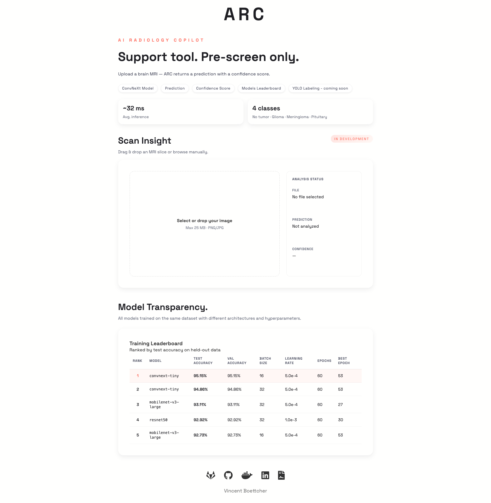
  <figcaption style="text-align:center;font-size:0.95rem;color:#555;margin-top:0.5rem;">ARC Homepage — ARC main landing with upload and predictions</figcaption>
</figure>

---

<figure style="max-width:800px;margin:0 auto;">
  
  <figcaption style="text-align:center;font-size:0.95rem;color:#555;margin-top:0.5rem;">ARC Image Uploaded — Displaying the uploaded MRI image</figcaption>
</figure>

---

<figure style="max-width:800px;margin:0 auto;">
  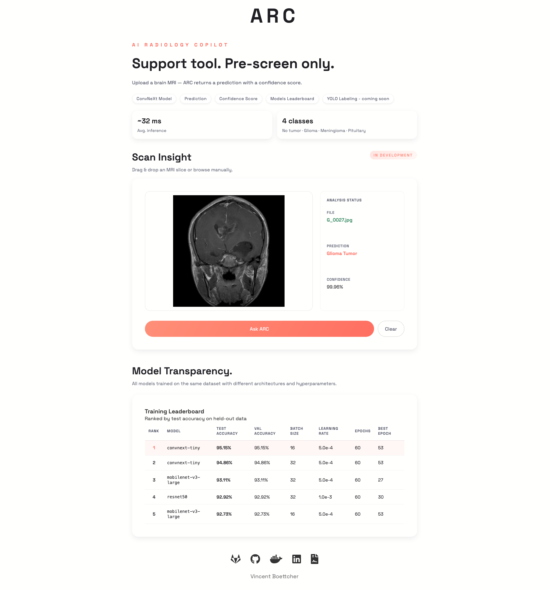
  <figcaption style="text-align:center;font-size:0.95rem;color:#555;margin-top:0.5rem;">ARC Prediction — Model prediction displayed with confidence score</figcaption>
</figure>

---

## Use Case

<figure style="max-width:800px;margin:0 auto;">
  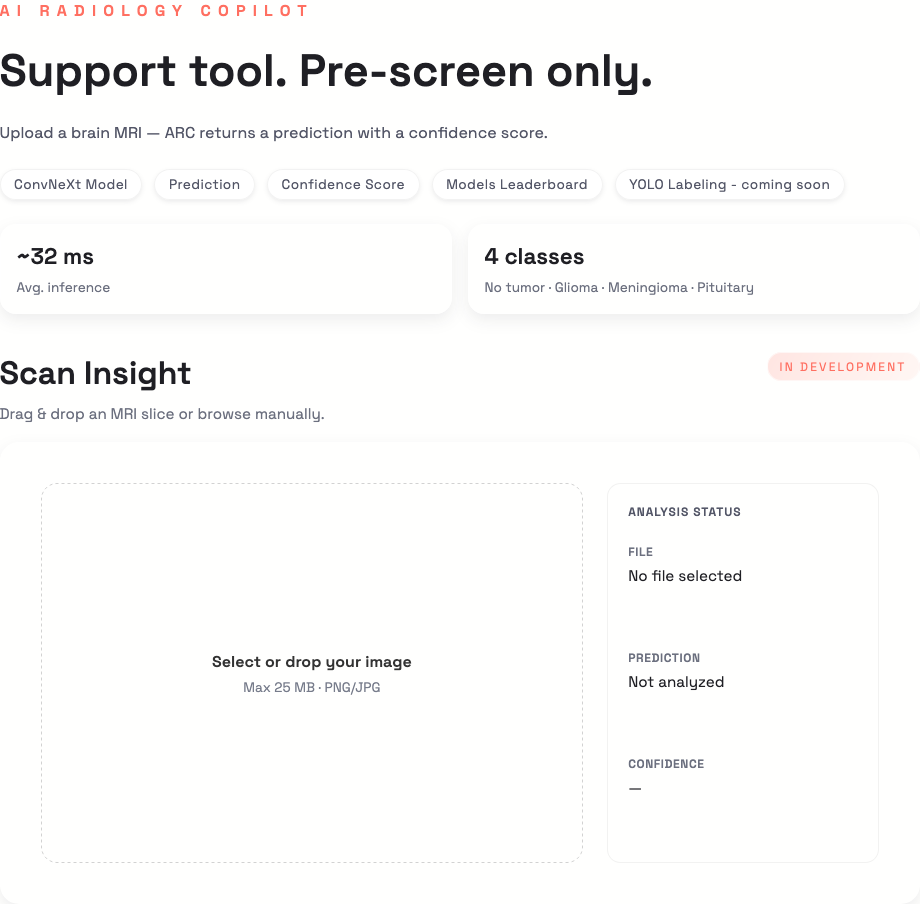
  <figcaption style="text-align:center;font-size:0.95rem;color:#555;margin-top:0.5rem;">ARC App - Upload Case Focus</figcaption>
</figure>

---

<figure style="max-width:800px;margin:0 auto;">
  
  <figcaption style="text-align:center;font-size:0.95rem;color:#555;margin-top:0.5rem;">ARC App - Upload Case Focus with an MRI</figcaption>
</figure>

---

<figure style="max-width:800px;margin:0 auto;">
  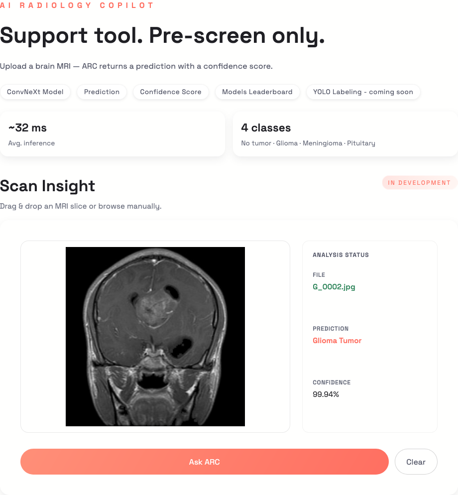
  <figcaption style="text-align:center;font-size:0.95rem;color:#555;margin-top:0.5rem;">ARC App - Prediction Case Focus</figcaption>
</figure>

---

### Project Structure

```
├── ai/                     # AI models and training scripts
├── backend/                # FastAPI backend application
├── data/                   # Dataset files
├── frontend/               # Frontend web application (HTML, CSS, JS)
├── iac/                    # Infrastructure as Code (Vagrant + Ansible)
├── k8s/                    # Kubernetes deployment manifests
├── models/                 # Pre-trained model weights
├── screenshots/            # Screenshots and visual assets
├── scripts/                # Utility scripts
├── shared/                 # Shared utilities and resources
├── docker-compose.yml      # Docker Compose configuration
├── docker-compose.dev.yml  # Docker Compose for development
├── .gitlab-ci.yml          # GitLab CI/CD pipeline configuration
├── README.md               # Project documentation
└── ...                     # Other configuration and resource files
```    

---

### Technical Stack

- **AI Model:** Convolutional Neural Network (ConvNeXt) using PyTorch
- **Backend:** FastAPI
- **Frontend:** HTML, CSS, JavaScript
- **Containerization:** Docker, Docker Compose
- **Orchestration:** Kubernetes (Minikube for local development)
- **Infrastructure as Code (IaC):** Vagrant + Ansible
- **CI/CD:** GitLab CI/CD
- **Monitoring:** Netdata Container

---

##  Installation Options

### Option A - Using Public Docker Hub Images

**Using Pre-built Docker Images**
Public images are available on Docker Hub for easy user setup:
- [ARC AI on Docker Hub](https://hub.docker.com/r/vinbr/arc-backend)
- [ARC Backend on Docker Hub](https://hub.docker.com/r/vinbr/arc-backend)

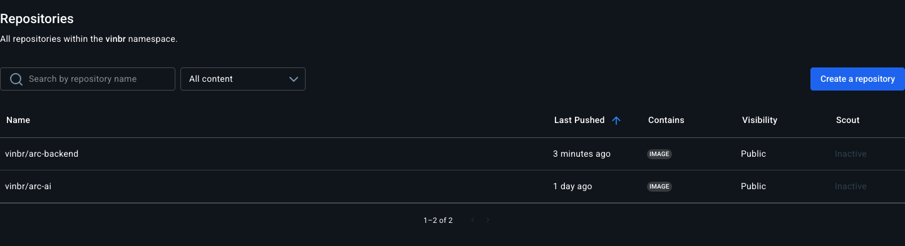

Before you start:
- make sure you have [Docker](https://www.docker.com/get-started/) installed on your machine.

```shell
# Clone the repository (SSH or HTTPS):
git clone git@gitlab.com:vin-br/arc.git # SSH
git clone https://gitlab.com/vin-br/arc.git # HTTPS

# From root directory, pull and start the containers:
docker compose up

# The images will be automatically pulled from Docker Hub on first run
# Access the app at:
http://localhost:8000
```

The app should now be running locally on your machine through Docker containers and accessible at the specified URL: `http://localhost:8000`

> The Docker backend image includes the necessary model weights, so no additional download is required.

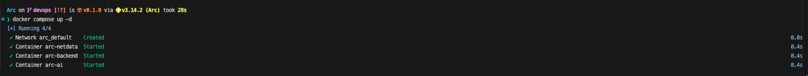

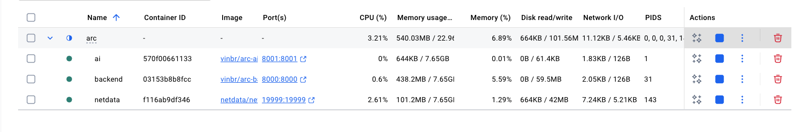

```shell
# To stop the containers, run:
docker compose down

# To update to the latest images:
docker compose pull
docker compose up
```

--- 

### Option B - Using Docker Developer Setup

Before you start:
- make sure you have [Docker](https://www.docker.com/get-started/) installed on your machine.

```shell
# Clone the repository with SSH:
git clone git@gitlab.com:vin-br/arc.git

# From root directory, build and start the development containers:
docker compose -f docker-compose.dev.yml up --build

# This will:
# - Build images locally from Dockerfiles
# - Mount local code for live reload during development
# - Use local model files from ./models directory

# Access the app at:
http://localhost:8000
```

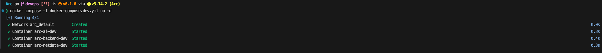

---

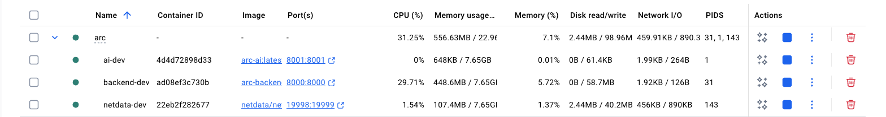

```shell
# To stop the containers, run:
docker compose -f docker-compose.dev.yml down

# To rebuild without cache:
docker compose -f docker-compose.dev.yml build --no-cache
```

**Developer setup includes:**
- Live code reloading (code changes reflect immediately)
- Local model weights for testing different versions
- Access to source code for debugging

---

### Option C - Using Kubernetes with Minikube

Before you start:
- Make sure you have [Minikube](https://kubernetes.io/docs/tasks/tools/install-minikube/) installed
- Make sure you have [kubectl](https://kubernetes.io/docs/tasks/tools/) installed

For detailed Kubernetes deployment instructions, see [k8s/README.md](k8s/README.md)

```shell
# # From root directory, start and deploy:
minikube start
kubectl apply -f k8s/namespace.yaml
kubectl apply -f k8s/
```

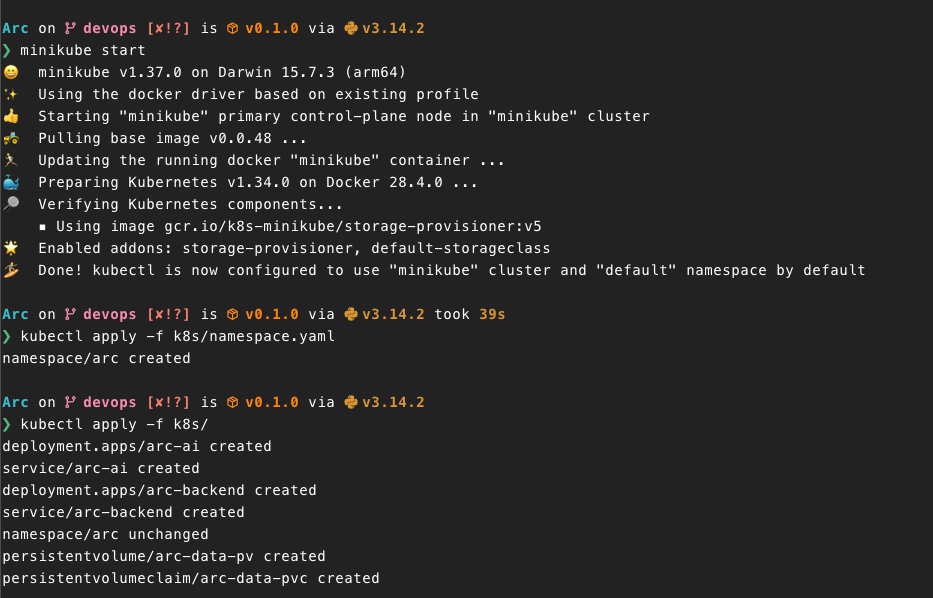

```shell
# Check deployment status
# Verify that the backend and AI pods are running before continuing
kubectl get all -n arc

# Access the application
# Note: Backend may take a minute to load the ML model on first startup
# Be patient!

# Using minikube service (tested with Docker driver on macOS)
minikube service arc-backend -n arc
# This will open your browser automatically
```


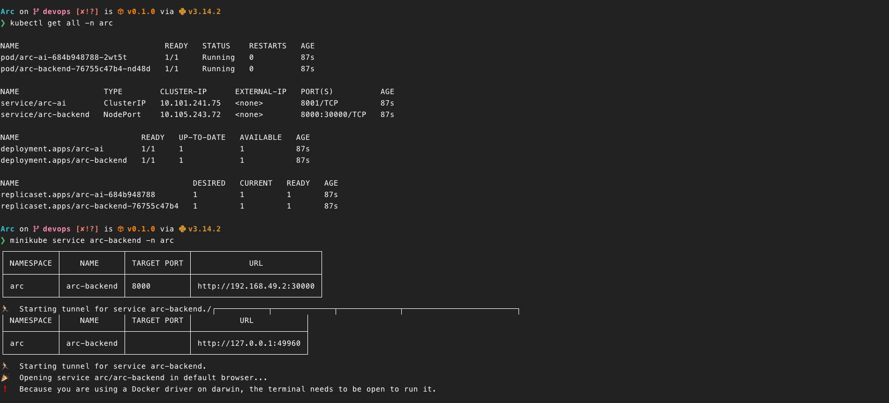

---

### Option D - Using Vagrant + Ansible (IaC)

Before you start, make sure you have the following installed:
- [Vagrant](https://www.vagrantup.com/downloads)
- [VirtualBox](https://www.virtualbox.org/wiki/Downloads)
- [Ansible](https://docs.ansible.com/ansible/latest/installation_guide/intro_installation.html)

For detailed instructions, see [iac/README.md](iac/README.md)

```shell
# Navigate to the iac directory
cd iac

# Start and provision the VM
vagrant up

# This will:
# - Create a Fedora 40 VM
# - Install Python 3.14.2 and dependencies using uv
# - Start the application as a systemd service
# - Run a health check

# Access the application at:
http://localhost:8080

# Or re-run Ansible without recreating the VM
vagrant provision

# Common commands:
vagrant halt      # Stop the VM
vagrant ssh       # Connect to the VM
vagrant destroy   # Delete the VM
```

Starting the ARC VM with Vagrant should look like this:


### Option E - Local Developer setup

**Installation steps to set up the project locally using uv:**

Before you start:
- make sure you have curl installed on your machine if you are on macOS/Linux.

```shell
# clone the repository with SSH:
git clone git@gitlab.com:vin-br/arc.git

# Install uv (on macOS/Linux)
curl -LsSf https://astral.sh/uv/install.sh | sh

# Or alternatively on Windows:
powershell -ExecutionPolicy ByPass -c "irm https://astral.sh/uv/install.ps1 | iex"

# if uv install fails, check the documentation at https://docs.astral.sh/uv/ for other installation methods.

# From root directory, install Python 3.14.2 with uv:
uv python install 3.14.2

# Create and activate a virtual environment:
uv venv --python 3.14.2
source .venv/bin/activate # On macOS/Linux or WSL/Git Bash
.venv\Scripts\activate # On Windows / PowerShell

# Install the dependencies:
uv sync --group dev
```

**Run FastAPI app:**
```shell
# From root directory
uv run uvicorn backend.app.main:app --reload
```

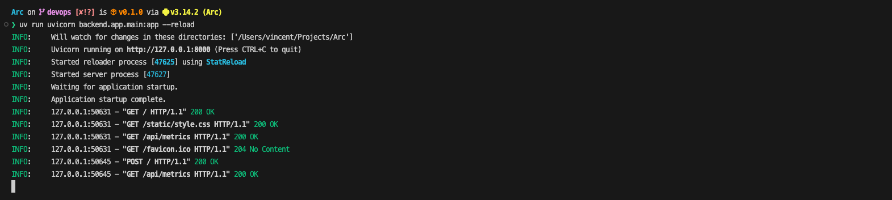

The app should now be running locally on your machine with a local install and accessible at the specified URL: ```http://localhost:8000```.

## Swagger API Documentation

The API documentation is automatically generated using FastAPI and can be accessed via Swagger UI at the following URL when the application is running:

```shell
# Swagger UI
http://localhost:8000/docs
```

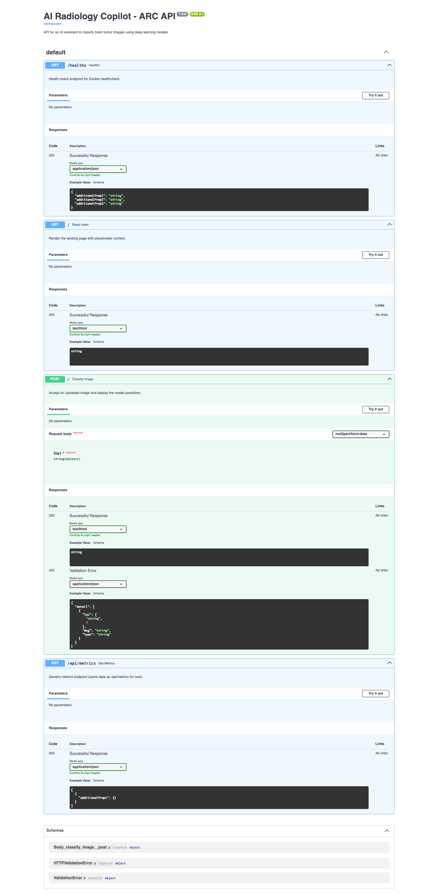

---

## CI/CD Pipeline

The project uses **GitLab CI/CD** with 3 stages:
1. **Lint** → Runs `ruff` on Python code
2. **Test** → Runs `pytest` on backend
3. **Build** → Builds and pushes Docker images to GitLab Container Registry

On develop branch, only Lint and Test stages run.
On main branch, all 3 stages run.

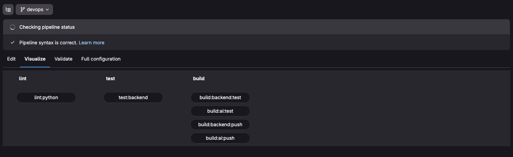

**Setup:**

```shell
# 1. Push to GitLab
git remote add gitlab https://gitlab.com/vin-br/arc.git
git push gitlab main

# 2. Configure CI/CD Variables
# Go to Settings → CI/CD → Variables and add:
# - CI_REGISTRY: registry.gitlab.com
# - CI_REGISTRY_USER: GitLab username
# - CI_REGISTRY_PASSWORD: Personal access token (with api, read_registry, write_registry scopes)
```

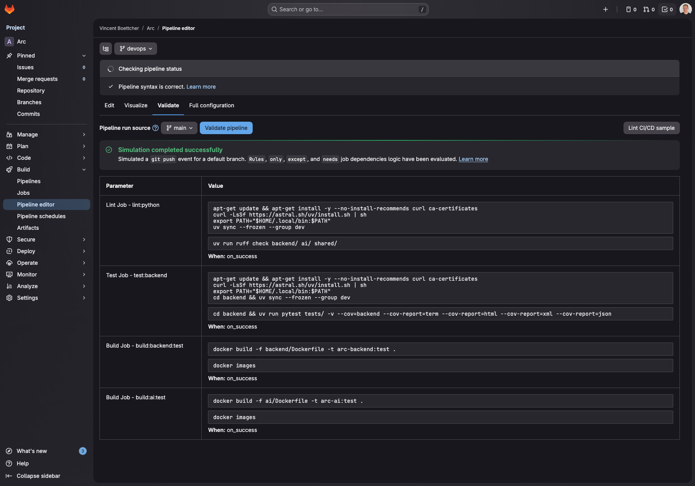


---

## Unit testing

```shell
# Run Tests from root with verbose output
uv run pytest backend/tests/ -v --tb=auto
```

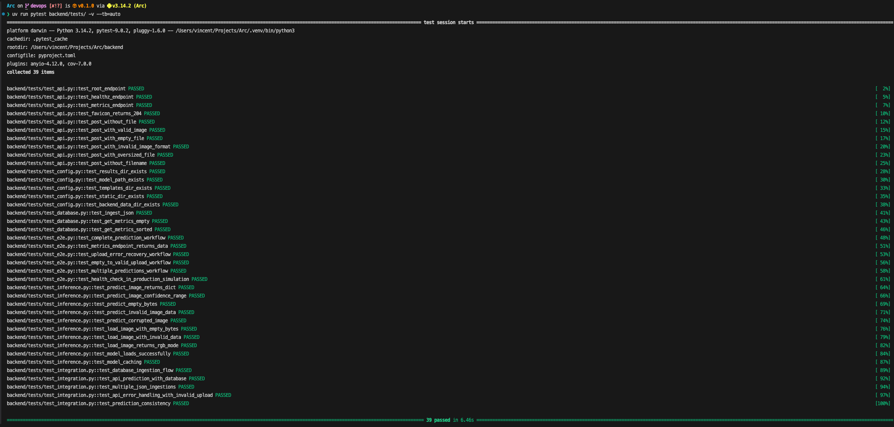


```shell
# Run Test Coverage for the backend with a report in the terminal
uv run pytest backend/tests/ --cov=backend/app --cov-report=term-missing
```

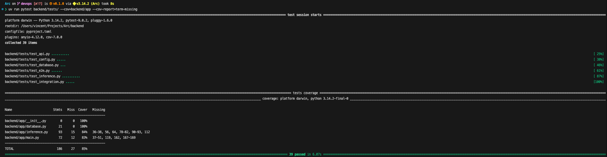


```shell
# Run Test Coverage with an HTML report
uv run pytest --cov=backend --cov-report=html
```

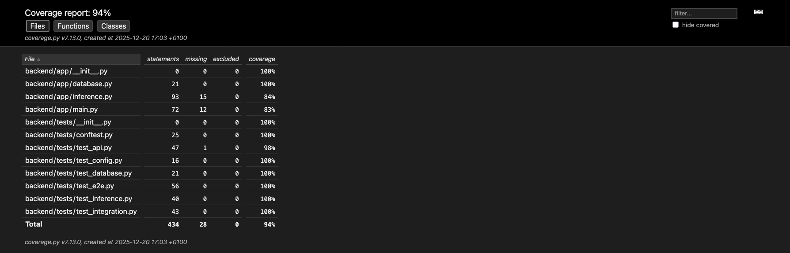

---

## Monitoring Containers with Netdata Container

To monitor the Docker containers running the ARC application, you can use Netdata Container. It is started with the Docker Compose setup and provides real-time monitoring of system and application metrics.

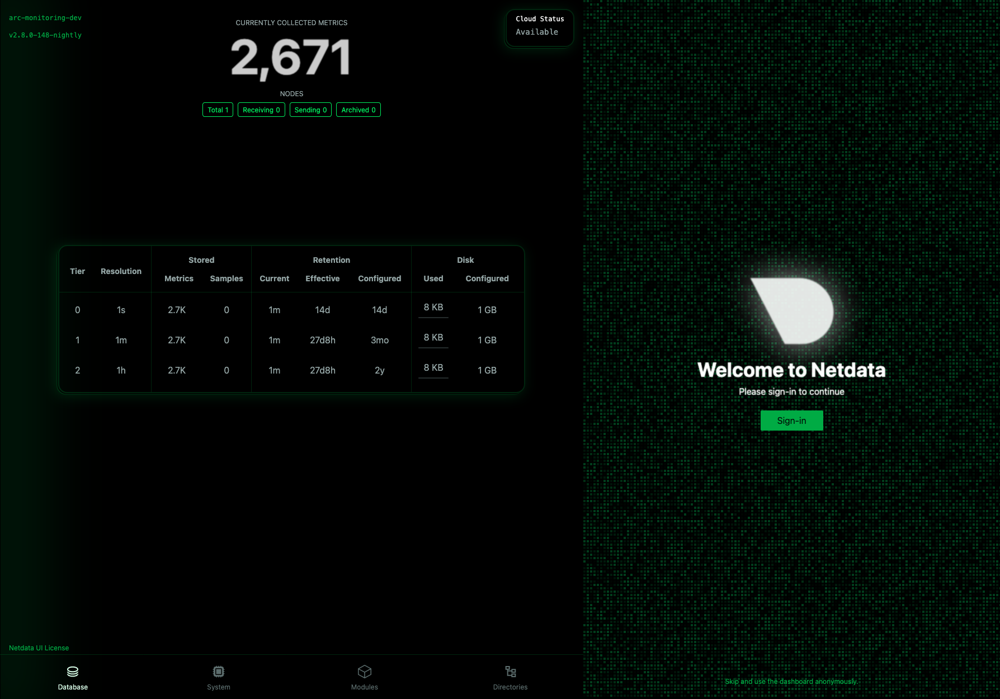

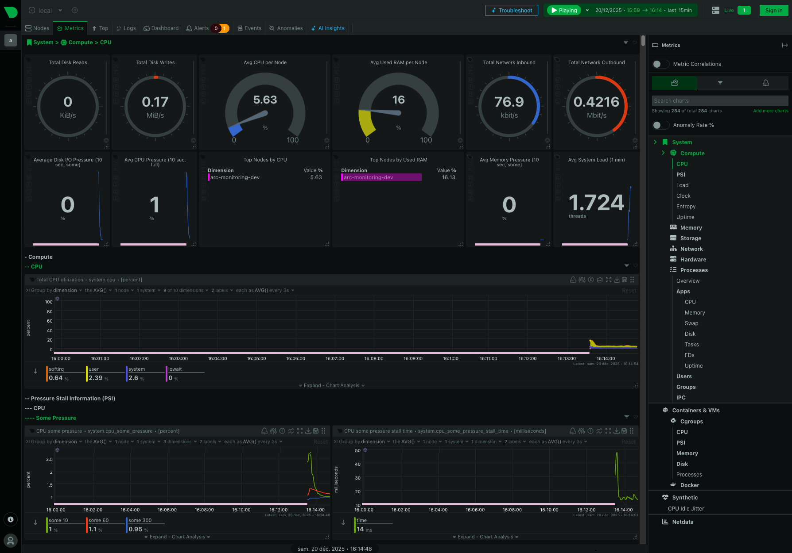

---

## Model Metrics

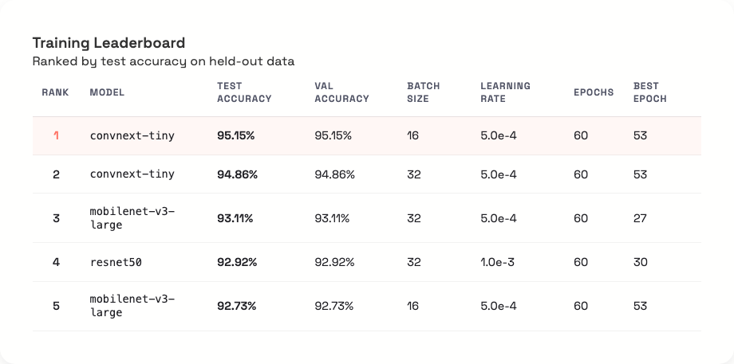

## Resources

### Datasets

A combination of these datasets:
- [dataset 1](https://www.kaggle.com/datasets/sartajbhuvaji/brain-tumor-classification-mri)
- [dataset 2](https://www.kaggle.com/datasets/thomasdubail/brain-tumors-256x256/data)
- [dataset 3](https://www.kaggle.com/datasets/masoudnickparvar/brain-tumor-mri-dataset?rvi=1)

Steps taken to clean the dataset:
1. Duplicates were removed. 
2. Files automatically renamed. 
3. Images were shuffled.
4. Images were split between training and testing (0.80/0.20).

### Documentation

- [PyTorch](https://docs.pytorch.org/docs/stable/index.html)
- [FastAPI](https://fastapi.tiangolo.com/)
- [pytest](https://docs.pytest.org/en/stable/)
- [uv](https://docs.astral.sh/uv/)
- [Ruff](https://docs.astral.sh/ruff/)
- [Ty](https://docs.astral.sh/ty/)
- [Docker](https://docs.docker.com/manuals/)
- [GitLab CI/CD Docs](https://docs.gitlab.com/ee/ci/)
- [Kubernetes Docs](https://kubernetes.io/docs/home/)
- [Minikube Docs](https://minikube.sigs.k8s.io/docs/)
- [Vagrant Docs](https://developer.hashicorp.com/vagrant/docs)
- [Vagrant Fedora 40 Bento Box](https://portal.cloud.hashicorp.com/vagrant/discover/bento/fedora-40)
- [Netdata Docs](https://learn.netdata.cloud/docs/agent/packaging/docker)

## Disclamer

This project is built for training and learning purposes, do not use it for real use cases.
