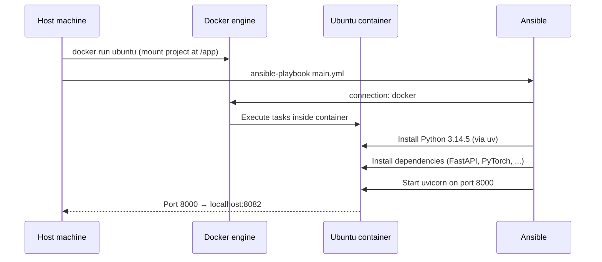

# ECHO Infrastructure as Code (IaC)

Provision the ECHO backend inside a Docker container using Ansible — no VMs, no SSH.

## How it works

Ansible uses the **Docker connection plugin** to run tasks directly inside a container, bypassing SSH entirely. The host machine runs a lightweight Ubuntu container, mounts the project into it, and Ansible installs everything from scratch — just like it would on a real server.



## Prerequisites

- **[Docker](https://docs.docker.com/get-docker/)**
- **[Ansible](https://docs.ansible.com/ansible/latest/installation_guide/intro_installation.html)**

```bash
brew install ansible  # macOS
```

## Quick start

```bash
./iac-docker.sh             # Start container + provision
```

**Access the app:** http://localhost:8082

## Commands

```bash
./iac-docker.sh             # Provision (idempotent)
./iac-docker.sh destroy     # Remove the container
```

## Checking the application

```bash
docker exec echo-target cat /var/log/echo-backend.log   # View logs
docker exec -it echo-target bash                       # Interactive shell
docker ps -f name=echo-target                          # Check status
```

## Troubleshooting

```bash
# Run Ansible with verbose output
ANSIBLE_CONFIG=iac/ansible.cfg ansible-playbook \
  -i iac/playbooks/inventory.ini \
  iac/playbooks/main.yml -vvv

# Rebuild from scratch
./iac-docker.sh destroy && ./iac-docker.sh
```
